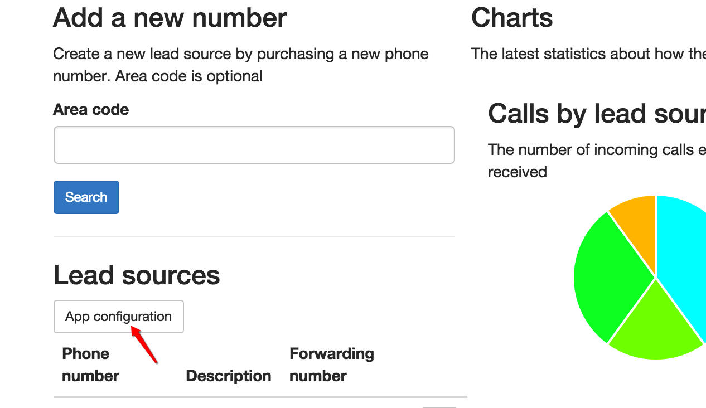
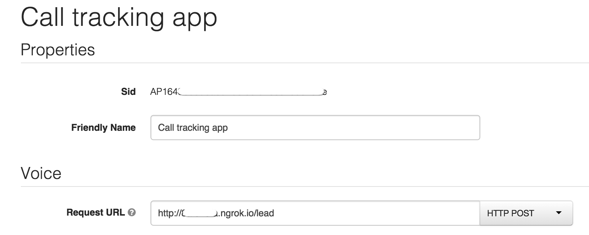

<a href="https://www.twilio.com">
  
</a>

# Call tracking

[](https://travis-ci.org/TwilioDevEd/call-tracking-node)

Call Tracking helps you measure the effectiveness of different marketing campaigns. By assigning a unique phone number to different advertisements, you can track which ones have the best call rates and get some data about the callers themselves. For a step-by-step tutorial see [twilio docs](https://www.twilio.com/docs/tutorials/walkthrough/call-tracking/node/express) to help with setting this up.

### Create a TwiML App

This project is configured to use a **TwiML App**, which allows us to easily set the voice URLs for all Twilio phone numbers we purchase in this app.

[Create a new TwiML app](https://www.twilio.com/console/phone-numbers/dev-tools/twiml-apps/add) and use its `Sid` as the `TWILIO_APP_SID` environment variable wherever you run this app.


See the end of the "Local development" section for details on the exact URL to use in your TwiML app.

Once you have created your TwiML app, [configure your Twilio phone number](https://www.twilio.com/help/faq/twilio-client/how-do-i-create-a-twiml-app). If you don't have a Twilio phone number yet, you can purchase a new number in your [Twilio Account Dashboard](https://www.twilio.com/console/phone-numbers/search).

## Local development

First you need to install
  - [Node.js](http://nodejs.org/) which should also install [npm](https://www.npmjs.com/).
  - [MongoDB](https://www.mongodb.org/)

1. First clone this repository and `cd` into its directory:
    ```
    git clone git@github.com:TwilioDevEd/browser-calls-node.git

    cd browser-calls-node
    ```

1. Install dependencies:
    ```
    npm install
    ```

1. Copy the sample configuration file and edit it to match your configuration
    ```bash
    $ cp .env .env.local
    ```
    You can find your `TWILIO_ACCOUNT_SID` and `TWILIO_AUTH_TOKEN` in your
    [Twilio Account Settings](https://www.twilio.com/console).
    You will also need a `TWILIO_PHONE_NUMBER`, which you may find [here](https://www.twilio.com/console/phone-numbers/incoming).

    Run `source .env.local` to export the environment variables


1. Run the application.
    ```
    node ./bin/www
    ```
    Alternatively you might also consider using [nodemon](https://github.com/remy/nodemon) for this. It works just like
    the node command, but automatically restarts your application when you change any source code files.

    ```
    npm install -g nodemon
    nodemon ./bin/www
    ```

1. Run the application.
    ```
    $ npm start
    ```

1. To actually forward incoming calls, your development server will need to be publicly accessible. [We recommend using ngrok to solve this problem](https://www.twilio.com/blog/2015/09/6-awesome-reasons-to-use-ngrok-when-testing-webhooks.html).

1. Once you have started ngrok, update your TwiML app's voice URL setting to use your ngrok hostname, so it will look something like this:

    ```
    http://88b37ada.ngrok.io/call/connect
    ```

## Run the tests
    You can run the tests locally by typing

    ```
    npm test
    ```

### Try it out
In your Twilio app configuration you'll need to set
`http://<your-ngrok-domain>.ngrok.io/lead` as the callback URL. Open
the application and then click the "App configuration" button.



The button will take you to your TwiML call tracking
application. Under "Voice" you will find a "Request URL" input
box. There you should put the URL to the application's lead resource
(e.g `http://<your-ngrok-domain>.ngrok.io/lead`).



## Meta

* No warranty expressed or implied. Software is as is. Diggity.
* [MIT License](http://www.opensource.org/licenses/mit-license.html)
* Lovingly crafted by Twilio Developer Education.
